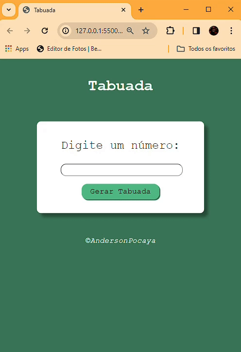

# Tabuada

Bem-vindo ao Projeto da Tabuada!

Este é um projeto simples desenvolvido para ajudar no aprendizado e prática da tabuada de multiplicação.

## Visão Geral

Este projeto consiste em uma página web interativa que permite aos usuários praticar a tabuada de multiplicação. A interface é simples e amigável, projetada para ser intuitiva e fácil de usar.

## Funcionalidades

- Prática de multiplicação para números de 1 a 10.
- Interface simples e intuitiva.
- Funciona em navegadores web modernos.

## Tecnologias Utilizadas

- HTML
- CSS
- JavaScript
